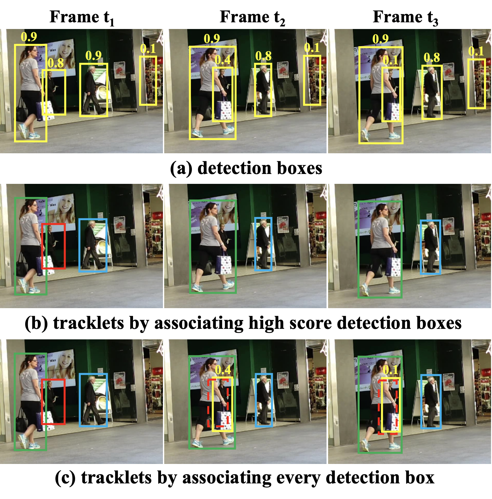

# predicion_movimiento_TPre

# Deteccion
## OpenMMLab website mmdetection [[Ghithub]](https://github.com/open-mmlab/mmdetection/blob/master/)

[📘Documentation](https://mmdetection.readthedocs.io/en/stable/) |
[🛠️Installation](https://mmdetection.readthedocs.io/en/stable/get_started.html) |
[👀Model Zoo](https://mmdetection.readthedocs.io/en/stable/model_zoo.html) |
[🆕Update News](https://mmdetection.readthedocs.io/en/stable/changelog.html) |
[🚀Ongoing Projects](https://github.com/open-mmlab/mmdetection/projects) |
[🤔Reporting Issues](https://github.com/open-mmlab/mmdetection/issues/new/choose)

# Seguimiento

## ByteTrack [[paper]](https://arxiv.org/abs/2110.06864)[[Ghithub]](https://github.com/ifzhang/ByteTrack)

### Google Colab

||

## Test en MOT
### Resultados en el conjunto de prueba de desafío MOT
| Dataset    |  MOTA | IDF1 | HOTA | MT | ML | FP | FN | IDs | FPS |
|------------|-------|------|------|-------|-------|------|------|------|------|
|MOT17       | 80.3 | 77.3 | 63.1 | 53.2% | 14.5% | 25491 | 83721 | 2196 | 29.6 |
|MOT20       | 77.8 | 75.2 | 61.3 | 69.2% | 9.5%  | 26249 | 87594 | 1223 | 13.7 |

### Resultados de visualización en el conjunto de prueba de desafío MOT
   
   

# Depth
## Global-Local Path Networks for Monocular Depth Estimation with Vertical CutDepth [[Paper]](https://arxiv.org/abs/2201.07436) [[Ghithub]](https://github.com/vinvino02/GLPDepth)

### Downloads
- [[Downloads]](https://drive.google.com/drive/folders/17yYbLZS2uQ6UVn5ET9RhVL0y_X3Ipl5_?usp=sharing) Trained ckpt files for NYU Depth V2 and KITTI
- [[Downloads]](https://drive.google.com/drive/folders/1LGNSKSaXguLTuCJ3Ay_UsYC188JNCK-j?usp=sharing) Predicted depth maps png files for NYU Depth V2 and KITTI Eigen split test set

### Google Colab

Thanks for the great Colab demo from NielsRogge

# Prediccion

# Instalaciones 

Siga las guias de cada uno de los apartados que aporntan en su github

# Training

Habria que entrenear cada parte 
