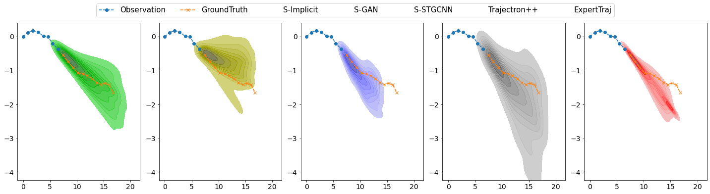
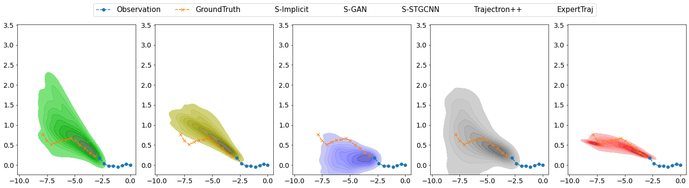

# Predicción de trayectorias

Esta sección se encarga de realizar la predicción de trayectoria para el futuro siguiendo un procedimiento apoyado en el uso de redes de grafos espacio-temporales o STGN. Para ello recurrimos a ExpertTraj, un modelo que se caracteriza por estimar objetivos y calcular la trayectoria hacia estos a partir de trayectorias observadas. Alcanza hasta 12 frames de predicción con 8 frames observables.

## Entrenamiento

El entrenamiento del modelo se lleva a cabo mediante los datasets SDD (Stanford Drone Dataset) y ETH/UCY, que contienen instancias en el formato:

[Frame_ID    Ped_ID    Ped_X    Ped_y]

Estas instancias son procesadas en bloques de 8 frames consecutivos para la trayectoria observable y los 12 frames consecutivos siguientes, que se corresponden con el Ground Truth. Se lleva a cabo un entrenamiento con el optimizador Adam, y las métricas de error empleadas para validar los modelos son:

*ADE* -> Average Distance Error, mide el promedio de error de distancia en cada punto de la predicción. 
*FDE* -> Final Distance Error, mide el error de distancia en el destino de la predicción.

| **Dataset**                           | **ADE** | **FDE** |
| --------------------------------- | ------- | ------- |
| **SDD**  | 10.49    | 13.21   |
| **ETH**                     | 0.3662    | 0.6516   |
| **HOTEL**                     | 0.1076    | 0.1474   |
| **ZARA1**                     | 0.1511   | 0.3106   |
| **ZARA2**                     |  0.1160   |  0.2554  |
| **UNIV**                     |  0.2017   | 0.4365   |

Con estos datos es posible comparar el modelo con otros:

El paper del que se extrae esta comparativa propone utilizar AMD/AMV (distancia Mahalanobis promedio y Autovalor máximo promedio) en vez de FDE y ADE ya que estas métricas sólo consideran la predicción más cercana a la realidad, mientras que AMD y AMV consideran todas las predicciones y se centran en modelos con conjuntos de predicciones más uniformes y precisos frente a predicciones más variadas.

Sin embargo, las comparativas demuestran que los datos son erróneos para ExpertTraj, ya que obtiene un error medio de 19.20 que no está reflejado en el resto de métricas ni en las pruebas visuales, por lo que asumimos que la métrica está mal calculada para este modelo y rechazamos su validez.

## Comparativa entre los 5 modelos principales:

## Visualización

La visualización está disponible en:

## Social-Implicit: Rethinking Trajectory Prediction Evaluation and The Effectiveness of Implicit Maximum Likelihood Estimation, ECCV2022 [[Paper]](https://arxiv.org/abs/2203.03057) [[Demo_interactiva]](ttps://www.abduallahmohamed.com/social-implicit-amdamv-adefde-demo) [[Github]](https://github.com/ajlorenzo1315/predicion_movimiento_TPre)
### Abduallah Mohamed, Deyao Zhu, Warren Vu  
### Mohamed Elhoseiny* , Christian Claudel*
##### ** Equal advising