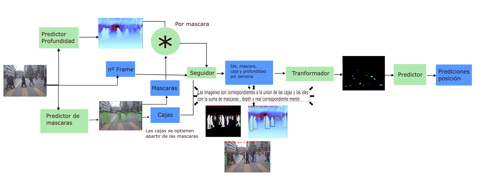

## TPre

	Nuestro enfoque combina varias técnicas de visión artificial para convertir una entrada frontal monocular en una vista cenital de las posiciones de los peatones para la posterior predicción de trayectoria: detección, segmentación y seguimiento de instancias, y estimación de la profundidad de los objetos en la imagen. Con estos métodos se genera un entorno simulado con posiciones de peatones que se emplea como entrada para la predicción de trayectorias simultáneas. Aspiramos a predecir con bastante precisión hasta 12 fotogramas de información en tiempo real para ofrecer mayor seguridad en la conducción autónoma.

## Demo 

En el notebook inference_demo se realiza una demo explicada

